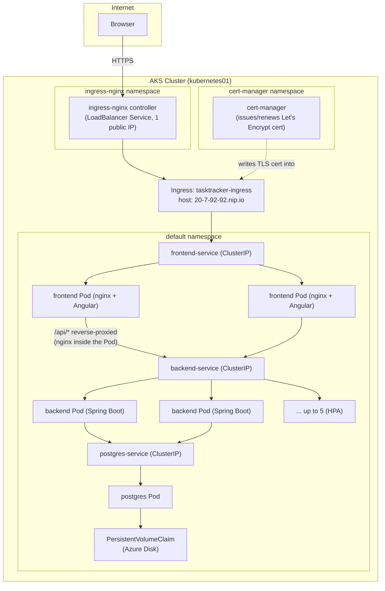
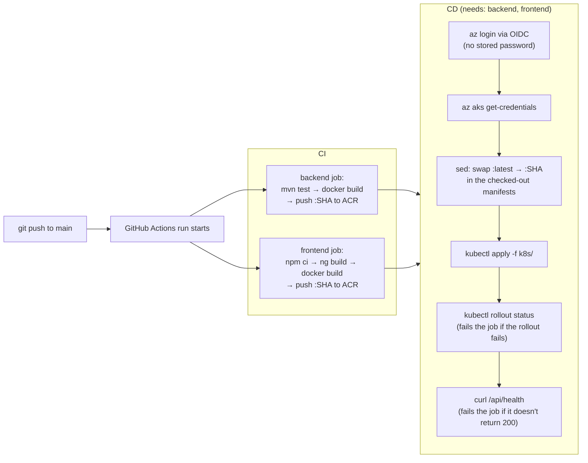
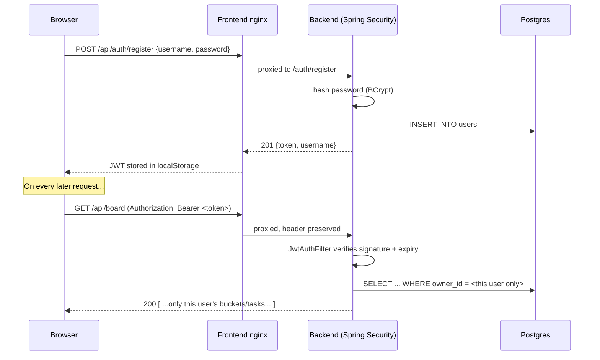
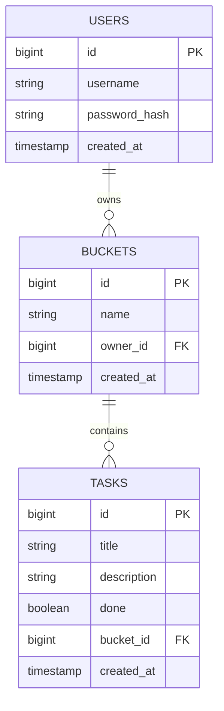

# TaskTracker

A full-stack, multi-user task board (Trello-style buckets and cards), built as an end-to-end
Kubernetes learning project — real authentication, real HTTPS, real autoscaling, and a real
CI/CD pipeline, all running on Azure Kubernetes Service (AKS).

**Live at: https://20-7-92-92.nip.io**

> That address is a free [nip.io](https://nip.io) hostname that resolves straight to the
> Ingress controller's public IP. It is **not a stable, permanent URL** — if the Ingress
> controller's LoadBalancer Service is ever deleted and recreated, Azure will likely assign a
> new public IP, and this address will change. Check `kubectl get ingress` for the current
> host if this link stops working.

---

## What this project actually demonstrates

This app is deliberately over-engineered for its own size — the point was never "build a
to-do list," it was to have a real reason to touch nearly every core Kubernetes concept:

| Concept | Where it shows up |
|---|---|
| Pods, Deployments, ReplicaSets | Every workload in `k8s/` |
| Services (ClusterIP) | Internal-only routing (`backend-service`, `postgres-service`) |
| Ingress + TLS | `k8s/13-ingress.yaml`, real Let's Encrypt certificate via cert-manager |
| ConfigMaps & Secrets | `k8s/01-configmap.yaml`, `k8s/02-secret.yaml` (gitignored — see below) |
| PersistentVolumeClaims | Postgres storage, backed by a real Azure Disk |
| Liveness/Readiness probes | Backend `/health` endpoint |
| HorizontalPodAutoscaler | Backend scales 2→5 replicas on CPU |
| RBAC (ServiceAccount/Role/RoleBinding) | `k8s/11-rbac.yaml` |
| CI/CD | GitHub Actions → Azure Container Registry → AKS, triggered by every push to `main` |

## Feature list

- Email/password registration and login (JWT-based auth)
- Every user's boards, buckets, and tasks are private to them — enforced at the database
  query level, not just hidden in the UI
- Create any number of **buckets** (e.g. "Market", "Library") to organize tasks into
- Tasks have a title, an optional description, and a done/undone state
- Move a task between buckets via a dropdown on its card
- Real HTTPS with a trusted certificate (not self-signed)
- Backend automatically scales under load

---

## Architecture



**Why the frontend Pod proxies `/api`, rather than the browser calling the backend
directly**: `backend-service` is `ClusterIP` — intentionally unreachable from outside the
cluster. The browser can only ever reach the frontend Pod's own embedded nginx, which then
forwards `/api/*` to the backend over the cluster's internal network. This means the API is
never directly exposed to the internet at all.

## CI/CD pipeline



Authentication from GitHub Actions to Azure uses **OpenID Connect (OIDC) federation** — no
Azure password or client secret is stored in GitHub at all. GitHub issues a short-lived,
cryptographically signed token proving "this run really is from this repo, this branch,"
and Azure trusts it because of a federated credential configured on an App Registration,
scoped to exactly that repo+branch.

Every image is tagged with the triggering commit's SHA, never `:latest` — this is what
makes deploys traceable and lets `kubectl apply` actually detect a change and roll out a
new version automatically, instead of silently doing nothing (a real problem this project
hit while everything was still being deployed by hand).

## Authentication flow



## Data model



Every Task belongs to exactly one Bucket; every Bucket belongs to exactly one User. Deleting
a Bucket cascades and deletes its Tasks. There is no cross-user sharing — ownership is
enforced at the repository-query level (`findByIdAndOwnerId`, `findByIdAndBucket_Owner_Id`),
not just hidden in the UI.

---

## Repository structure

```
tasktracker/
├── README.md                  ← you are here
├── docker-compose.yml         ← local dev: all 3 services on one machine
├── .github/workflows/ci.yml   ← CI + CD pipeline (see diagram above)
├── backend/                   ← Spring Boot API — see backend/README.md
├── frontend/                  ← Angular app — see frontend/README.md
└── k8s/                       ← Kubernetes manifests (see table below)
```

## Kubernetes manifests reference

| File | Kind | Purpose |
|---|---|---|
| `01-configmap.yaml` | ConfigMap | Non-sensitive config: DB host/port/name, backend proxy URL |
| `02-secret.yaml` *(gitignored)* | Secret | DB username/password — see `02-secret.example.yaml` for the shape |
| `02b-jwt-secret.yaml` *(gitignored)* | Secret | JWT signing key — see `02b-jwt-secret.example.yaml` for the shape |
| `03-postgres-pvc.yaml` | PersistentVolumeClaim | 1Gi, dynamically provisioned as an Azure Disk |
| `04-postgres-deployment.yaml` | Deployment | Postgres, 1 replica (a real setup would use a StatefulSet or managed DB) |
| `05-postgres-service.yaml` | Service (ClusterIP) | Internal DNS name for Postgres |
| `06-backend-deployment.yaml` | Deployment | Spring Boot API, 2 replicas, probes + resource requests/limits |
| `07-backend-service.yaml` | Service (ClusterIP) | Internal-only — never exposed directly to the internet |
| `08-backend-hpa.yaml` | HorizontalPodAutoscaler | 2–5 replicas, target 60% CPU |
| `09-frontend-deployment.yaml` | Deployment | Angular + nginx, 2 replicas |
| `10-frontend-service.yaml` | Service (ClusterIP) | Sits behind the shared Ingress, not its own LoadBalancer |
| `11-rbac.yaml` | ServiceAccount, Role, RoleBinding | Least-privilege example: read-only Pod access |
| `12-cluster-issuer.yaml` | ClusterIssuer (cert-manager) | Let's Encrypt production issuer |
| `13-ingress.yaml` | Ingress | The one public entry point; TLS termination |

Two cluster-wide add-ons are installed separately via Helm (not part of `k8s/`, since they're
shared infrastructure, not app-specific): **ingress-nginx** (the Ingress controller itself)
and **cert-manager** (automatic certificate issuance/renewal).

## Running locally

```bash
docker compose up -d --build
```

Starts Postgres, the backend, and the frontend together with the same environment-variable
wiring used in Kubernetes. See `docker-compose.yml` for the exact ports.

## Deploying

In practice, you never deploy by hand — every push to `main` does it automatically via the
CI/CD pipeline described above. To do it manually (e.g. from a clean cluster):

```bash
kubectl apply -f k8s/
```

Note that the two Secret files are gitignored and won't exist in a fresh checkout — apply
them from your own values first (see the `.example.yaml` files), or the backend/postgres
Pods will fail to start.

## Further reading

- [`backend/README.md`](backend/README.md) — API reference, security model, entity design
- [`frontend/README.md`](frontend/README.md) — component structure, auth handling, build process
