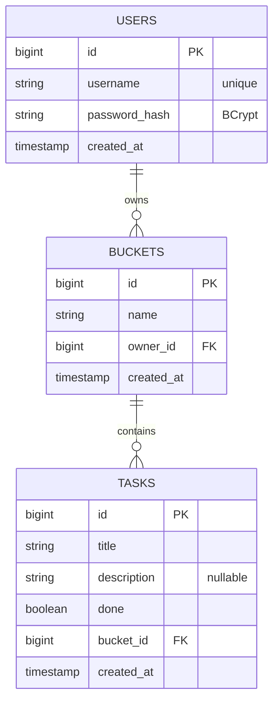
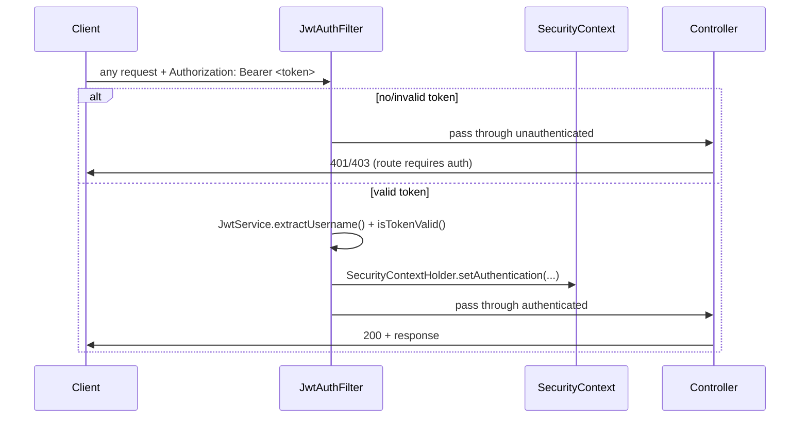

# TaskTracker Backend

A Spring Boot REST API providing JWT-authenticated, per-user task/bucket management backed by
PostgreSQL.

See the [project-level README](../README.md) for the overall architecture, CI/CD pipeline,
and Kubernetes deployment. This document covers the backend specifically.

## Tech stack

| Layer | Choice |
|---|---|
| Language / runtime | Java 17 |
| Framework | Spring Boot 3.3.4 |
| Persistence | Spring Data JPA + Hibernate, PostgreSQL |
| Auth | Spring Security, stateless JWT (io.jsonwebtoken / jjwt) |
| Password hashing | BCrypt |
| Build | Maven |
| Container | Multi-stage Docker build → `eclipse-temurin:17-jre-jammy` runtime |

## Package structure

```
com.tasktracker.backend
├── TaskTrackerApplication.java   # entry point
├── User.java / UserRepository.java
├── Bucket.java / BucketRepository.java
├── Task.java / TaskRepository.java
├── AuthController.java           # POST /auth/register, /auth/login
├── BucketController.java         # GET /board, POST/DELETE /buckets
├── TaskController.java           # POST/PUT/DELETE /tasks
├── HealthController.java         # GET /health (public, used by k8s probes)
├── dto/                          # request/response records
└── security/
    ├── SecurityConfig.java       # filter chain, CORS, auth rules
    ├── JwtService.java           # sign/verify/parse JWTs
    ├── JwtAuthFilter.java        # reads Authorization header per-request
    └── UserDetailsServiceImpl.java
```

## Data model



`Bucket.tasks` is a `@OneToMany(cascade = ALL, orphanRemoval = true)` — deleting a bucket
deletes every task inside it. There is no "unfiled" task state; every task always belongs to
exactly one bucket.

**Ownership enforcement happens in the query itself**, not as an after-the-fact check:

```java
// BucketRepository
Optional<Bucket> findByIdAndOwnerId(Long id, Long ownerId);

// TaskRepository
Optional<Task> findByIdAndBucket_Owner_Id(Long id, Long ownerId);
```

If a caller tries to read/update/delete a bucket or task they don't own, these queries
simply return empty — there's no code path where "found it, but it's not yours" can be
accidentally skipped.

## Authentication



- Passwords are hashed with **BCrypt** (`PasswordEncoder` bean) — the raw password is never
  stored or logged.
- JWTs are signed with **HMAC-SHA**, using a secret key injected via the `JWT_SECRET`
  environment variable (never hardcoded — see Configuration below).
- Tokens expire after **24 hours** (`JwtService.EXPIRATION_MS`).
- `/health` and `/auth/**` are the only routes that don't require a token
  (`SecurityConfig.filterChain`); every other route requires a valid, unexpired JWT.
- CORS is currently permissive (`allowedOriginPatterns: "*"`) — acceptable here because the
  browser never calls this API directly in production (see the project README's note on the
  frontend's reverse proxy); it exists mainly to allow local development flexibility.

## REST API reference

All endpoints are relative to the backend's root; in the deployed app they're reached via
`https://<host>/api/...` through the frontend's nginx proxy.

| Method | Path | Auth required | Body | Notes |
|---|---|---|---|---|
| `POST` | `/auth/register` | No | `{ username, password }` | Password must be ≥ 6 characters. Returns `201` + `{ token, username }`, or `409` if the username is taken. |
| `POST` | `/auth/login` | No | `{ username, password }` | Returns `200` + `{ token, username }`, or `401`. |
| `GET` | `/health` | No | — | Always `200`; body is `{ status, version }`. Used by Kubernetes liveness/readiness probes — deliberately doesn't check the database. |
| `GET` | `/board` | Yes | — | Returns every bucket the caller owns, each with its tasks nested: `[{ id, name, tasks: [...] }]`. One call renders the whole UI. |
| `POST` | `/buckets` | Yes | `{ name }` | Creates a bucket owned by the caller. |
| `DELETE` | `/buckets/{id}` | Yes | — | `204` on success, `404` if not found/not owned. Cascades to delete its tasks. |
| `POST` | `/tasks` | Yes | `{ title, description, bucketId }` | `bucketId` must belong to the caller or this returns `400`. |
| `PUT` | `/tasks/{id}` | Yes | `{ title?, description?, done?, bucketId? }` | Partial update — only non-null fields are applied. Changing `bucketId` is how a task moves between buckets. |
| `DELETE` | `/tasks/{id}` | Yes | — | `204` on success, `404` if not found/not owned. |

Authenticated requests use `Authorization: Bearer <token>`.

## Configuration (environment variables)

No credentials are hardcoded anywhere in source — everything comes from the environment,
sourced from a Kubernetes ConfigMap/Secret in the deployed app, or `docker-compose.yml`
locally. **Values are intentionally omitted here** — see the project root's
`k8s/02-secret.example.yaml` and `k8s/02b-jwt-secret.example.yaml` for the shape.

| Variable | Purpose |
|---|---|
| `DB_HOST` | Postgres hostname |
| `DB_PORT` | Postgres port |
| `DB_NAME` | Database name |
| `DB_USER` | Database username |
| `DB_PASSWORD` | Database password |
| `JWT_SECRET` | HMAC signing key for JWTs |

## Building and running

**Locally (needs a running Postgres and the env vars above):**
```bash
mvn spring-boot:run
```

**Via Docker** (multi-stage: Maven build stage → slim JRE runtime stage, runs as a non-root user):
```bash
docker build -t tasktracker-backend .
```

**Full stack, including Postgres:** see `docker-compose.yml` at the project root.

## Known gaps / honest limitations

- **No automated tests yet.** The CI pipeline runs `mvn test`, but there are currently zero
  test classes — it's only proving the code compiles, not that it behaves correctly. A real
  next step would be adding controller/repository tests (e.g. with `@SpringBootTest` +
  Testcontainers for a real Postgres in CI).
- **Schema managed by `spring.jpa.hibernate.ddl-auto=update`**, not versioned migrations
  (Flyway/Liquibase). Fine for a learning project; a real production service would want
  migrations it can review, test, and roll back.
- **CORS is wide open** (see Authentication above) — fine given the network topology today,
  but would need tightening if the API were ever exposed directly.
