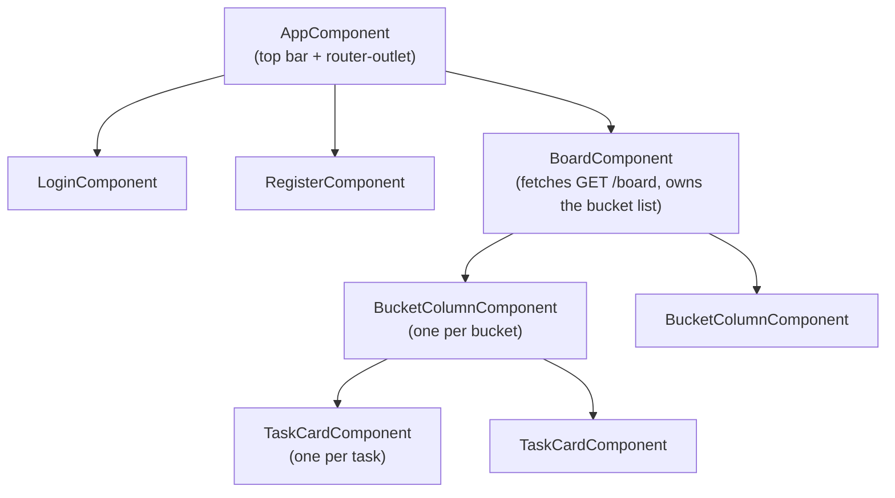
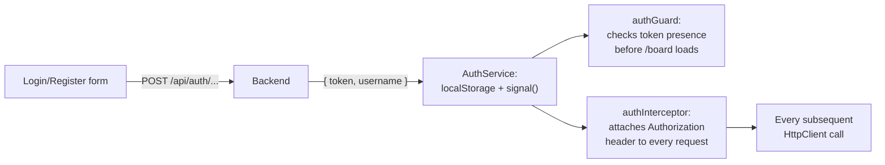
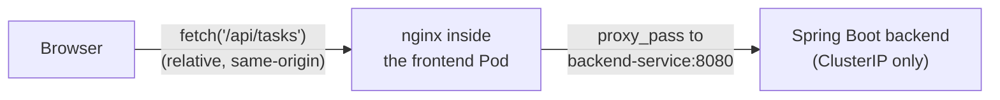

# TaskTracker Frontend

An Angular single-page app implementing the login/register flow and the kanban-style task
board, served by nginx (which also reverse-proxies API calls to the backend).

See the [project-level README](../README.md) for the overall architecture, CI/CD pipeline,
and Kubernetes deployment. This document covers the frontend specifically.

## Tech stack

| Layer | Choice |
|---|---|
| Framework | Angular 17, standalone components (no NgModules) |
| Routing | `@angular/router`, with a functional `CanActivateFn` guard |
| HTTP | `HttpClient` + a functional interceptor for auth headers |
| State | Component-level state + one `signal()` for the logged-in username |
| Styling | Plain CSS per component (no framework/library) |
| Container | Multi-stage Docker build → static files served by `nginx:1.27-alpine` |

## Component structure



Data flows one way down (`@Input()`), events flow one way up (`@Output()`): a checkbox click
inside `TaskCardComponent` emits an event, `BucketColumnComponent` calls the API, and on
success emits `changed` up to `BoardComponent`, which re-fetches `/board` — there's no local
mutation of nested state, the server response is always the source of truth after any write.

## Routing

| Path | Component | Guarded? |
|---|---|---|
| `/login` | `LoginComponent` | No |
| `/register` | `RegisterComponent` | No |
| `/board` | `BoardComponent` | Yes — `authGuard` redirects to `/login` if no token |
| `/`, `/**` | redirects to `/board` | — |

## Authentication handling



- The JWT is stored in `localStorage` (not just an in-memory variable) specifically so that
  refreshing the page, or closing and reopening the tab, doesn't force a re-login — this is
  what "preserves state" across sessions until the token itself expires.
- `authInterceptor` (a plain function, registered via `provideHttpClient(withInterceptors([...]))`)
  attaches `Authorization: Bearer <token>` to every outgoing request automatically — no
  component or service individually deals with auth headers.
- `authGuard` is a `CanActivateFn` that blocks navigation to `/board` (or anything else that
  uses it) unless a token is present.

## Talking to the backend



`BoardService` and `AuthService` call **relative** paths like `/api/board`, never a full URL.
This is deliberate: the backend's Kubernetes Service is `ClusterIP`-only, so the browser
could never reach it directly even if it tried. Instead, nginx inside the frontend's own
container (see `nginx.conf.template`) reverse-proxies `/api/*` to the backend over the
cluster's internal network. The backend's actual address is injected at container startup via
the `BACKEND_URL` environment variable and substituted into the nginx config by
`docker-entrypoint.sh` — this is the mechanism that satisfies "read the backend URL from an
environment variable" even though this Angular code never touches that variable directly;
it's applied one layer down, at the only layer that can actually reach a `ClusterIP` Service.

## Building and running

**Local dev server** (talks to whatever `ng serve`'s dev-server proxy is configured for —
currently there is none, so this is best used with `docker-compose.yml` running the backend
separately, or by adjusting `board.service.ts`'s base path temporarily):
```bash
npm install
npm start
```

**Production build:**
```bash
npm run build
```

**Via Docker** (multi-stage: Node build stage produces static files → nginx runtime stage serves them):
```bash
docker build -t tasktracker-frontend .
```

**Full stack, including the backend and Postgres:** see `docker-compose.yml` at the project root.

## Known gaps / honest limitations

- **No automated tests.** Nothing in `npm run build`'s CI step actually verifies behavior,
  only that the app compiles.
- **No drag-and-drop** — moving a task between buckets uses a `<select>` dropdown by design
  (a deliberate simplicity choice made early on, not an oversight); a Trello-style drag
  interaction would require pulling in a library like Angular CDK's drag-drop module.
- **`npm audit` currently reports vulnerabilities** in transitive build-tooling dependencies
  (Angular CLI's own dependency tree) — not exploitable in the shipped app since they only run
  at build time, but worth a deliberate, tested upgrade pass at some point rather than a blind
  `npm audit fix --force`.
